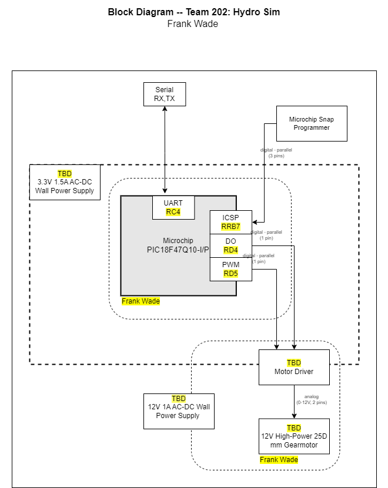

Block Diagram
---

The motor and motor driver block diagram to give a general representaiotn of how the microcontroller will work with the driver, be programed from a Snap programmer and connect to other systems.  

