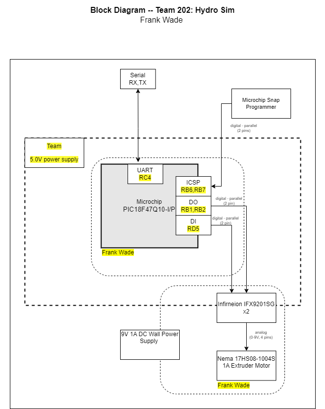

Block Diagram
---

The motor and motor driver block diagram to give a general representaiotn of how the microcontroller will work with the driver, be programed from a Snap programmer and connect to other systems.  

The requirements for this project was to have two different types of power, some means of communication with my team, 
a means to program my microcontroller and a way to engage my stepper motor. 
I used a 9V 1A power wall mount power supply through a barrel jack coupled with TEAM202 supplied power through ribbin cable. 

The PIC18F47Q10 was able to communicate with the A3909GLYTR-T motor driver through a series of pins which would send output signals to the Nema stepper motor.
Informatoin from the team comes in via the RX and inforation needing to go to the team is sent through the TX in a daisy chain /ribbin cable method. 

This specific process was done to allow for the PIC18F47Q10 to be programed by the SNAP controller, receive input from up stream via the chain and send output downs stream by a similar chain. This allowed for the motor driver to meet the requirements of the project. 
