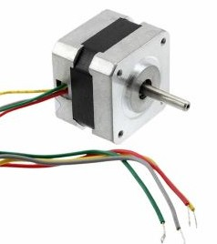

| Part                                      | Pros| Cons                                                                                                     |
| --------------------------------------------- | ------ | ------------------------------------------------------------------------------------------------------- |
|       [A3909](https://www.allegromicro.com/~/media/Files/Datasheets/A3909-Datasheet.ashx)                       | <ul><li>Designed for medium powered applications </li><li>Can work through power ranges 4V-18V</li><li>Has 4 paths input/output | <ul><li>Output current is 1 amp</li><li>Maximum voltage need is below the minumum threshold |
|     [IFX9201SGAUMA1](https://www.infineon.com/dgdl/Infineon-IFX9201SG-DS-v01_01-EN.pdf?fileId=5546d4624cb7f111014d2e8916795dea&ack=t)                           | <ul><li> Have used it before </li><li> Can interface with SPI </li><li> Can connect to the 3.3V  |<ul><li> Only has 2 Outs  </li><li>  </li><li> Technology in chip is 10 years old   |                                                                              
|    [DRV3946](https://www.ti.com/lit/ds/symlink/drv3946-q1.pdf?ts=1704149824935&ref_url=https%253A%252F%252Fwww.ti.com%252Fproduct%252FDRV3946-Q1). | <ul><li>Can handle up to 28V operating voltage </li><li>Will interface with 24-bit SPI   |<ul><li> Designed for automotive application specific </li><li> Too large for use   |
|  [26M048B2U](https://mm.digikey.com/Volume0/opasdata/d220001/medias/docus/2466/26M%20Series%20Wiring%20Diagram.pdf)                            | <ul><li>Step Angle is 15 Degrees</li><li>24 Steps per Revolution </li><li> Relatively small at 42.82MM width | <ul><li> Only a 4 step motor </li><li> Will need upto 4 connections </li><li> 11.30mm size shaft |
|    [324](https://cdn-shop.adafruit.com/product-files/324/C140-A+datasheet.jpg).                            | <ul><li>1.8 degree step angle </li><li>v24mm Shaft</li><li>2 wire to operate | <ul><li> .22kg mass </li><li>42.2mm size  |
|    [MIKROE-1530]((https://download.mikroe.com/documents/datasheets/step-motor-5v-28byj48-datasheet.pdf). | <ul><li>Operates at 5V </li><li> 5.625 degree step </li><li>   | <ul><li> Needs to use 3 wires to work </li><li> 10mm shaft </li><li> Might need a clip to work  | 

# Selected Components
## Choice MIKROE-1530
This stepper motor will be able to oporate with a less power, provide a adequate amount of torque to move a valve, and has a smal step angle to allow for greater adjustments. The size means that it will fit in a smaller area and can be mounted with screws rather than a bracket. 
## Choice IFX9201SGAUMA1
This full half bridge will interface in SPI so it will work with the selected chip. It will can be configured to work in both 3.3V and 5.0V allowing for one to utilize power elsewhere. For what the project needs, this driver fits the parameters the best. 
  

