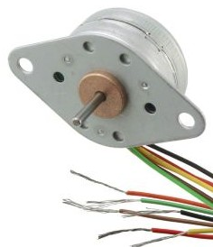

---
Selection of parts
---

|Motor Driver Part                                      | Pros| Cons  |  Data Sheet    |                                                                                           
| --------------------------------------------- | ------ | ------------------------------------------------------------------------ |-------|
| | <ul><li>Designed for medium powered applications </li><li>Can work through power ranges 4V-18V</li><li>Has 4 paths input/output | <ul><li>Output current is 1 amp</li><li>Maximum voltage need is below the minumum threshold |    [A3909](https://www.allegromicro.com/~/media/Files/Datasheets/A3909-Datasheet.ashx) |
|         | <ul><li> Have used it before </li><li> Can interface with SPI </li><li> Can connect to the 3.3V  |<ul><li> Only has 2 Outs  </li><li>  </li><li> Technology in chip is 10 years old   |   [IFX9201SGAUMA1](https://www.infineon.com/dgdl/Infineon-IFX9201SG-DS-v01_01-EN.pdf?fileId=5546d4624cb7f111014d2e8916795dea&ack=t)                     |                                                                              
|   | <ul><li>Can handle up to 28V operating voltage </li><li>Will interface with 24-bit SPI   |<ul><li> Designed for automotive application specific </li><li> Too large for use   |   [DRV3946](https://www.ti.com/lit/ds/symlink/drv3946-q1.pdf?ts=1704149824935&ref_url=https%253A%252F%252Fwww.ti.com%252Fproduct%252FDRV3946-Q1)| 

|Stepper  Part                                      | Pros| Cons  |  Data Sheet    |                                                                                           
| --------------------------------------------- | ------ | ------------------------------------------------------------------------ |-------|
|    | <ul><li>Step Angle is 15 Degrees</li><li>24 Steps per Revolution </li><li> Relatively small at 42.82MM width | <ul><li> Only a 4 step motor </li><li> Will need upto 4 connections </li><li> 11.30mm size shaft | [26M048B2U](https://mm.digikey.com/Volume0/opasdata/d220001/medias/docus/2466/26M%20Series%20Wiring%20Diagram.pdf) |
|        | <ul><li>1.8 degree step angle </li><li>v24mm Shaft</li><li>2 wire to operate | <ul><li> .22kg mass </li><li>42.2mm size  | [324](https://cdn-shop.adafruit.com/product-files/324/C140-A+datasheet.jpg).| 
|   | <ul><li>Operates at 5V </li><li>  5.625 degree step </li><li>   | <ul><li> Needs to use 3 wires to work </li><li> 10mm shaft </li><li> Might need a clip to work  |   [MIKROE-1530](https://download.mikroe.com/documents/datasheets/step-motor-5v-28byj48-datasheet.pdf). | 
|   | <ul><li>Operates at 5V </li><li> 1.8 degree step </li><li>   | <ul><li> Needs to use 4 wires to work </li><li> 20mm shaft </li><li> Might need a clip to work  |   [Nema 17](https://www.omc-stepperonline.com/index.php?route=product/product/get_file&file=92/17HS08-1004S%20Full%20Datasheet.pdf). |
|Microcontorller Part                                      | Pros| Cons  |  Data Sheet    |                                                                         | --------------------------------------------- | ------ | ------------------------------------------------------------------------|-------|
|   | <ul><li> Familiar with chip, used in class </li><li> Many GPIO pins for addtional components </li><li>   | <ul><li> Not as compact as similar chips </li> |   [PIC18F47Q10](https://ww1.microchip.com/downloads/en/DeviceDoc/PIC18F27-47Q10-Data-Sheet-40002043E.pdf). | 

|Voltage Regulator  Part                                      | Pros| Cons  |  Data Sheet    |                                                                      
| --------------------------------------------- | ------ | ------------------------------------------------------------------------ |-------|
|   | <ul><li> Very familiar with usage </li><li> will step down the voltage from 9V to 3.3V </li><li>   | <ul><li>  surface mounted  |   [LM2575T](https://www.digikey.com/en/products/detail/onsemi/LM2575T-3-3G/1476700). | 

# Selected Components
##  Nema 17Step Motor
This bipolar step motor will be able to oporate at 5V and provide adequate amount of torque to move a gate. It has a small step angle of 1.8 degrees allowing for greater adjustments. From mounting hole to mounting hole, its only 31millimeters with an overall diamerter of 42.3 millimeters. It is small yet functional and adequate for the project needs. 

##  IFX9201SGAUMA1 Motor driver
This full half bridge will interface in SPI and it will work with the selected chip. This chip model will output at 3.3 volts working with the step motor. Because the step motor is bipolar, it will need two drivers. One driver will control the motion of the step motor in one direction, the other chip will control the motion of the step motor in the other direction. 

##  PIC18F47Q10 Microcontroller
The Microchip microcontrol is part of the PIC18 family. This particular chip hosts 40 pins, 2 being VDD and VSS, 1 for MCLR and for GPIO. It possesses the ability to work either SPI or I2C for connecting with different peripherals. As the microcontroller used in class, the familiarity of it makes it ideal the project. 

## LM275D2T Voltage regulator
This voltage regular is a surface mounted regulater that will step down a 9V coming to an easier 3.3V. This particular part has been utilized before so the familiarity with its use, also makes it a great choice to use for this particular project. 

|Major Component Selection   Part                                      | Name |  
| --------------------------------------------- | ------ |
|PIC18F47Q10-E/PT |Micro Controler|
|LED | Green LED |
|IC Half Bridge Driver  | Motor Driver |
| Nema 17 | Stepper Motor |
| Schottky Diode | Diode  |
|LM275D2T| Voltage Regulator |

These parts were selected specifically because they all fit the parameters of the project and most of them were familiar to the design team. All major components except the Nema17 were surface mounted parts. This allow for the product to be geared towards an industry look. 

------
### Power Budget ###
------
Power is requried to run major components for the stepper driver and motor. One would need to know how much power is being used and how much still available.  The power budget focuses on both the supply voltage range and the maximum amont of current each component would take. This, with then given a 25% safety margin, allows for little more room to determine the most amount of amperage being drawn by the device. From this, one can determine how much is needed and how much can sent to others through the the communication chain. 

The power budget was advantagious to determine if an active part would work within the system. The biggets concern would be too much of a draw of power causing something to short out or burn out. My first PCB did not work properly causing must of the surface mounted components to heat up rapidly. My fourth PCB burned out a trace wire because there was no where for the voltage to go. Drawing more amperage would have caused componets to burn. The power budget helped prevent that. 

[Power Budget](./PowerBudgetComplete.pdf)
