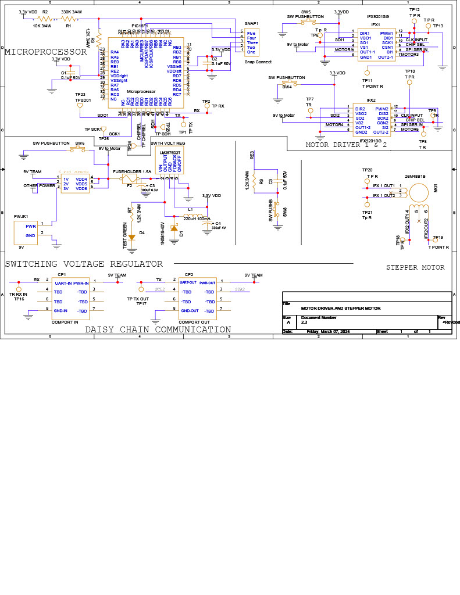

## Schematic of Motor Driver and Stepper Motor
-----------------------------------------------
This is the schematic for components to run the stepper motor and control the gate for the hydroelectric dam. The stepper motor is bipolar and will need two different motor drivers to move rotate in either direction. The 3 pin jumper is set up to switch between team power and wall power giving the setup an option to be powered independently. The reset switch connects to both the IFX1 and IFX2 drivers, giving power to the DIS port on each chip. This switch the port low to high causing the drivers to reset in the event a resent needs to take place. 

 

>  

*  [Schematic PDF](./motoDriver2.4.pdf)
*  [Schematic Folder](./StepMotor-Driver1-2.zip)
